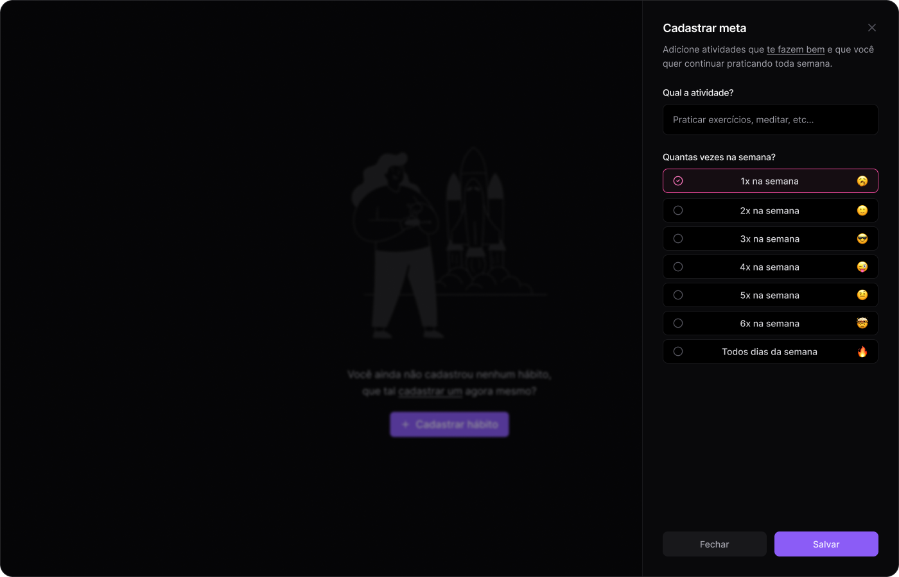
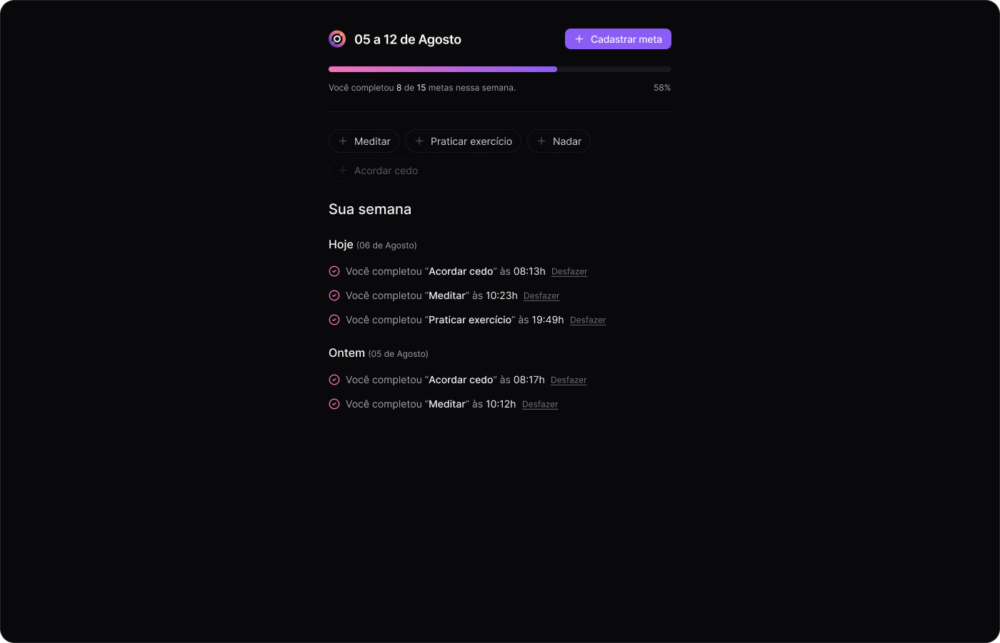

# inOrbit :rocket:

**inOrbit** é uma aplicação full-stack desenvolvida durante o evento **NLW Pocket** da Rocketseat como parte de um projeto de estudo. A aplicação tem como foco ajudar os usuários a gerenciar suas metas semanais, permitindo cadastrar metas, definir frequências e acompanhar o progresso ao longo do tempo.




## Recursos :clipboard:

* **Cadastro de metas personalizadas:** Os usuários podem definir metas semanais e estabelecer quantas vezes querem cumpri-las em um período de tempo.
* **Progresso em tempo real:** O progresso das metas é exibido de forma visual e intuitiva, permitindo que os usuários marquem as metas como completas à medida que as realizam.
* **Interface de usuário amigável:** Com uma interface focada na simplicidade, os usuários podem navegar facilmente e gerenciar suas metas com agilidade.
* **Arquitetura modular:** O projeto foi desenvolvido com uma estrutura que permite sua escalabilidade e manutenção futura.

## Como usar :computer:

**Requisitos:**

* Node.js e npm (ou yarn) instalados.
* Docker (para configurar o banco de dados e o ambiente de desenvolvimento).

**Instalação:**

1. Clone o repositório:

   ```bash
   git clone https://github.com/nop-dev/in-orbit-nlw.git
   ```

2. Acesse a pasta do projeto:

   ```bash
   cd in-orbit-nlw
   ```

3. Instale as dependências do front-end e back-end:

   ```bash
   cd web
   npm install
   cd ../server
   npm install
   ```

4. Configure as variáveis de ambiente com base no arquivo `.env.example`.

**Execução:**

1. Inicialize o banco de dados usando Docker:

   ```bash
   docker-compose up
   ```

2. Inicie o back-end:

   ```bash
   cd server
   npm run dev
   ```

3. Abra um novo terminal e inicie o front-end:

   ```bash
   cd web
   npm run dev
   ```

4. Acesse a aplicação no navegador: `http://localhost:5173/`.

## Tecnologias Utilizadas :hammer_and_wrench:

### Front-end

* **ReactJS:** Biblioteca para criação de interfaces reativas.
* **Vite:** Ferramenta de build rápida para front-end.
* **Radix UI:** Conjunto de componentes acessíveis e estilizados.
* **React Query:** Gerenciamento de estados assíncronos e cache de dados de API.
* **Tailwind CSS:** Framework CSS de utilitários para estilização rápida.
* **Zod:** Biblioteca de validação de esquemas para garantir a tipagem e integridade dos dados no front-end.

### Back-end

* **Node.js & Fastify:** Framework altamente performático para criação de APIs.
* **Drizzle ORM:** ORM tipado com foco em segurança e facilidade de uso em SQL.
* **PostgreSQL:** Banco de dados relacional robusto usado para persistir as informações das metas.
* **Zod:** Validação de dados no back-end, oferecendo segurança adicional nas operações de API.

### Outros

* **Docker:** Utilizado para configurar e containerizar o ambiente de desenvolvimento.
* **TypeScript:** Linguagem usada no front-end e no back-end, garantindo tipagem estática e evitando erros comuns.
* **Drizzle Kit:** Ferramenta usada para gerenciar migrações no banco de dados.

## Estrutura do Projeto :file_folder:

```bash
in-orbit-nlw/
├── web/        # Código do front-end (React, Vite)
└── server/     # Código do back-end (Node.js, Fastify)
```

| Nop-Dev, 2024 :rocket: |
| --- |

Deixe sua ⭐️ nesse repositório se você gostou do FocusTimer! Seu apoio é muito valioso para mim! 🚀
